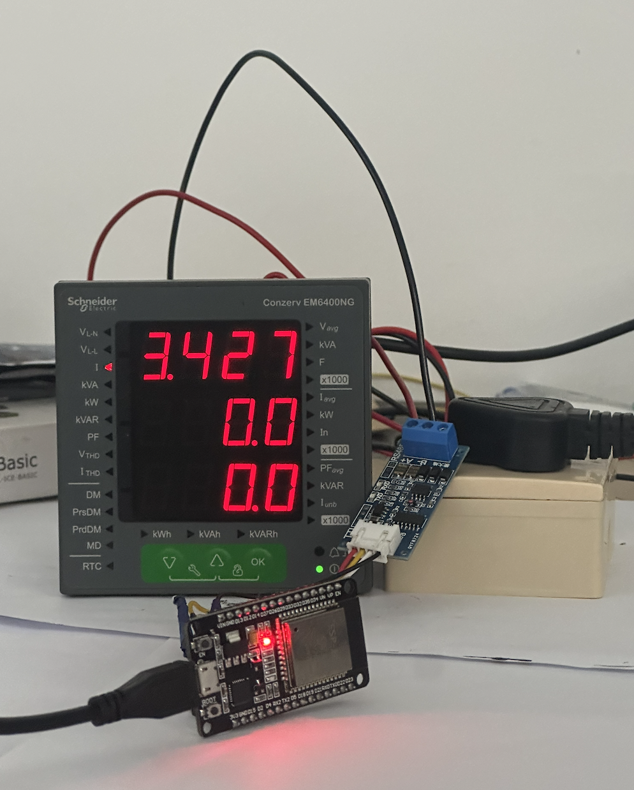
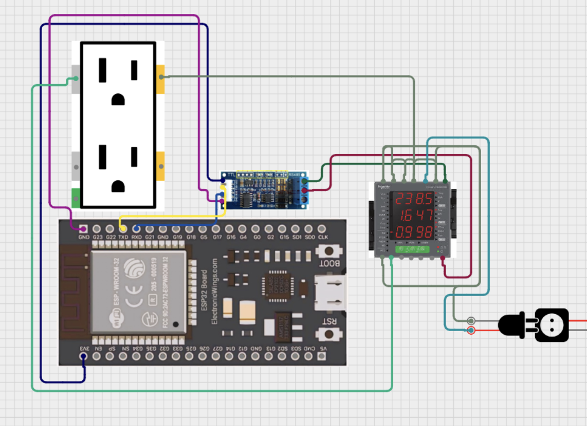

# ⚡ IoT-Based Energy Monitoring System

[](https://opensource.org/licenses/MIT)
[](https://www.espressif.com/en/products/socs/esp32)
[](https://modbus.org/)
[](https://mqtt.org/)

&gt; **Real-time energy monitoring using Modbus RTU over RS485 and MQTT protocols.**
&gt; 
&gt; An ESP32-based gateway reads electrical parameters from a Schneider Conzerv EM6400NG energy meter and transmits live data to the **Zoho IoT Cloud** for remote visualization, analytics, and alerting.

---

## 📸 Hardware in Action



**Components:**
- **ESP32** — IoT Gateway (WiFi + RS485)
- **Schneider Conzerv EM6400NG** — 3-Phase Energy Meter
- **RS485-to-TTL Module** — Serial communication bridge
- **Electrical Load (Switch Box)** — Monitored appliance

---

## 🏗️ System Architecture
┌─────────────────┐      RS485       ┌─────────────┐      WiFi/MQTT      ┌──────────────┐
│  Energy Meter   │ ◄───Modbus RTU──► │    ESP32    │ ◄──────MQTT──────► │  Zoho IoT    │
│ (Schneider EM6400NG)                │   Gateway   │    (TLS/SSL)       │   Cloud      │
└─────────────────┘                   └─────────────┘                    └──────────────┘
│                                    │                                   │
▼                                    ▼                                   ▼
Voltage, Current                    Data Processing                    Real-time Dashboard
Power, Frequency                    & JSON Packaging                   Alerts & Analytics


---

## 📋 Features

| Feature | Description |
|---------|-------------|
| 🔌 **Modbus RTU Communication** | Reads 9 holding registers from energy meter via RS485 |
| 📡 **MQTT over TLS** | Secure cloud transmission using Zoho IoT SDK |
| ⚙️ **WiFiManager Portal** | Captive portal for dynamic WiFi/MQTT credential configuration |
| 💾 **Non-Volatile Storage** | Credentials persisted in ESP32 flash memory |
| 🔄 **Auto-Recovery** | Automatic WiFi/MQTT reconnection on disconnect |
| 🚨 **Alarm Rules** | Configurable voltage/current thresholds in Zoho IoT |
| 📊 **Real-Time Dashboard** | Live visualization of power metrics with historical trends |

---

## 📊 Monitored Parameters

| Parameter | Register | Unit |
|-----------|----------|------|
| Frequency | 3109 | Hz |
| Current | 2999 | A |
| Voltage (L-L) | 3019 | V |
| Voltage (L-N) | 3027 | V |
| Apparent Power | 3069 | kVA |
| Reactive Power | 3061 | kVAR |
| Power Factor | 3077 | — |
| Active Power | 3053 | kW |
| Peak Demand Power | 3769 | kW |

---

## 🔧 Hardware Connections

| ESP32 Pin | RS485 Module | Function |
|-----------|--------------|----------|
| GPIO 16 (RX2) | RO (Receiver Out) | UART RX |
| GPIO 17 (TX2) | DI (Driver In) | UART TX |
| GPIO 0 | Button | Reset/Clear Credentials |
| 3.3V | VCC | Power |
| GND | GND | Ground |



---

## 🚀 Quick Start

### Prerequisites
- [Arduino IDE](https://www.arduino.cc/en/software) (v2.0+)
- [ESP32 Board Package](https://docs.espressif.com/projects/arduino-esp32/en/latest/installing.html)
- USB cable + ESP32 dev board

### Required Libraries

Install via **Sketch → Include Library → Manage Libraries**:

| Library | Version | Purpose |
|---------|---------|---------|
| `WiFiManager` | ^2.0.0 | Captive portal configuration |
| `ModbusMaster` | ^2.0.1 | Modbus RTU communication |
| `Zoho IoT Client` | Latest | MQTT client for Zoho Cloud |
| `Preferences` | Built-in | ESP32 NVS storage |

### Installation

```bash
# 1. Clone this repository
git clone https://github.com/itzgolly/iot-energy-monitor-modbus-mqtt.git

# 2. Open src/main.ino in Arduino IDE

# 3. Update credentials in src/credentials.h (or use WiFiManager portal)

# 4. Select Board: "ESP32 Dev Module"
#    Port: Your COM port

# 5. Upload and open Serial Monitor (115200 baud)

First Boot Configuration
Power on ESP32 → Creates WiFi hotspot AutoConnectAP
Connect phone/laptop to AutoConnectAP
Browser opens captive portal (or go to 192.168.4.1)
Enter:
Your WiFi SSID & Password
Zoho IoT MQTT Username & Password
Click Save → Device reboots and connects automatically
